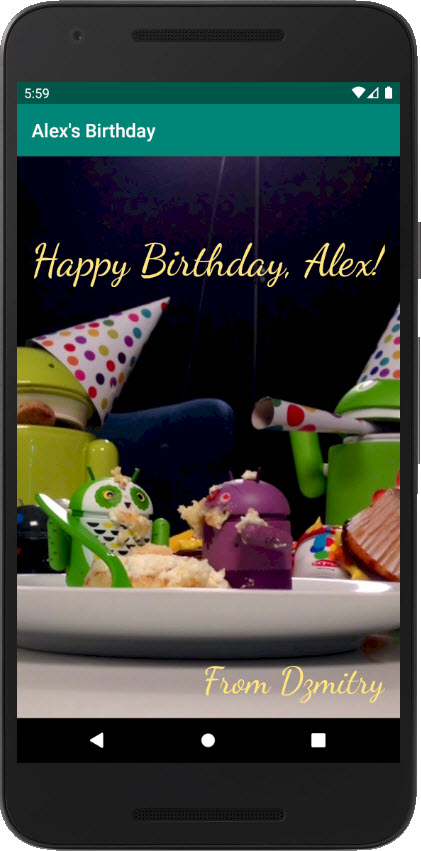

## Birthday Card application

This is a very simple `Hello World` like application.
The main part of the source code is in the
[`activity_main.xml`](app/src/main/res/layout/activity_main.xml) file:

Vertical screenshot in emulator:

Horizontal screenshot in emulator:

