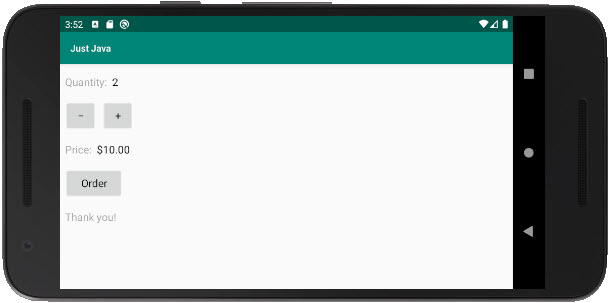
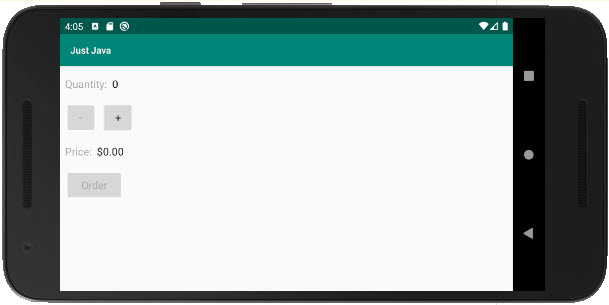

# Android Basics: User Input
By the end of this course, you’ll be able to make an Android app with buttons and text fields
that a user can interact with. This Java app allows user to fill out a form to order coffee.

Buttons are dynamically disabled, if cups quantity is zero,
because you can not order zero cups of coffee.

