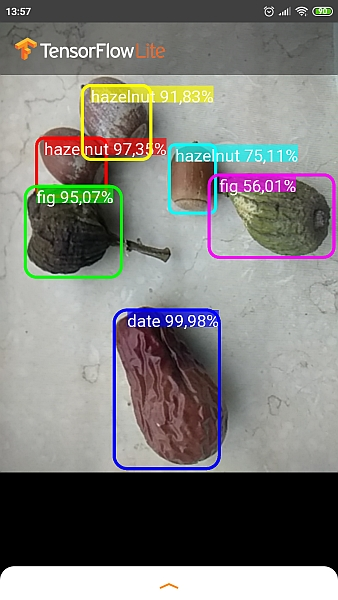
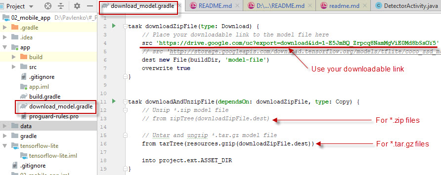
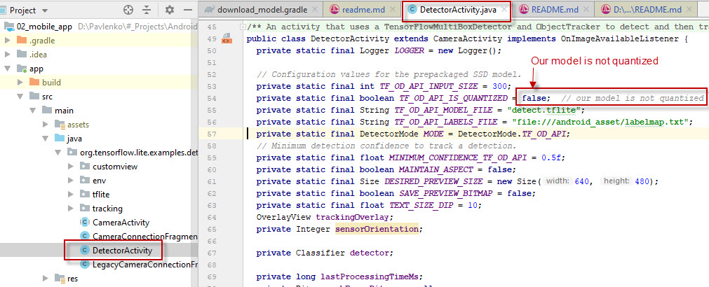

### Detect objects with TensorFlow Object Detection API.

The [TensorFlow Object Detection API](https://github.com/tensorflow/models/tree/master/research/object_detection)
is an open source framework built on top of TensorFlow that makes it easy to construct,
train and deploy **object detection** models.

There are 2 main components:
   01. [model training scripts](01_training_script) - 
       Google Colab `*.ipynb` scripts to use an object detection API.
          * [`demo_1.ipynb`](https://colab.research.google.com/drive/1OkqFXb1GSxi7oNkiGfGttSmhaob4ivFy)
            uses existing pre-trained model from the
            [model zoo](https://github.com/tensorflow/models/blob/master/research/object_detection/g3doc/detection_model_zoo.md)
            or the [list of pre-trained models](https://www.tensorflow.org/lite/guide/hosted_models#object_detection)
            optimized to work with TensorFlow Lite.
          * [`demo_2.ipynb`](https://colab.research.google.com/drive/1sKb5rXrwiJTxzk0jZxAmpfIYUg0gj4Bw)
       describes the process of creating your own dataset and training (transfer learning) a new model.
   02. [mobile app](02_mobile_app) -
       a mobile application that uses trained model in Android. It was copied from
       [TensorFlow Lite object detection Android Demo](https://github.com/tensorflow/examples/tree/master/lite/examples/object_detection/android).

To run model on your mobile phone:
   * Take existing pre-trained model from the
     [model zoo](https://github.com/tensorflow/models/blob/master/research/object_detection/g3doc/detection_model_zoo.md),
     test it with [`demo_1.ipynb`](https://colab.research.google.com/drive/1OkqFXb1GSxi7oNkiGfGttSmhaob4ivFy) script
     or train your own model on a new dataset
     ([`demo_2.ipynb`](https://colab.research.google.com/drive/1sKb5rXrwiJTxzk0jZxAmpfIYUg0gj4Bw)).
   * Create `*.tar.gz` or `*.zip` file from `detect.tflite` with your model and
     `labelmap.txt` with your labels. Save `*.tar.gz` or `*.zip`  to the Google Drive.
     **Note**: `labelmap.txt` file should start with `???` string, because zero position is reserved.
     So your class labels will start from the 1st position after `???` string.
   * Get downloadable direct link using direct link generator for
     [Google Drive](https://www.wonderplugin.com/online-tools/google-drive-direct-link-generator),
     [Dropbox or Onedrive](https://syncwithtech.blogspot.com/p/direct-download-link-generator.html).
   * Replace link in the mobile app [`download_model.gradle`](02_mobile_app/app/download_model.gradle)
     file on your link. Use `zipTree` for `*.zip` and `tarTree` for `*.tar.gz`.
     
   * Our model is not quantized, so set quantized to `false` in
     [`DetectorActivity.java`](02_mobile_app/app/src/main/java/org/tensorflow/lite/examples/detection/DetectorActivity.java)
     file
     
   * Delete `build` folder and clean `assets` folder.
     Rebuild the project: `Build --> Make Project` then `Build --> Build Bundles --> Build APK`.
   * Run mobile app (`Run --> Run 'app'`) in Android Studio and enjoy!

Links:
   * This article will help much: [Real-time face recognition](https://medium.com/@saidakbarp/real-time-face-recognition-tflite-3fb818ac039a)
   * Shareable link to file
     [`object_detection_demo_1.ipynb`](https://colab.research.google.com/drive/1OkqFXb1GSxi7oNkiGfGttSmhaob4ivFy).
     On GitHub `*.ipynb` documents usually do not open.
   * Shareable link to file
     [`object_detection_demo_2.ipynb`](https://colab.research.google.com/drive/1sKb5rXrwiJTxzk0jZxAmpfIYUg0gj4Bw).
   * Original article: [How to configure Tensorflow object detection API with google colab](https://chamaradodandeniya.wordpress.com/2019/04/16/how-to-configure-google-colab-for-object-detection-using-tensorflow/).
   * Original article: [How to train an object detection model easy for free](https://medium.com/swlh/how-to-train-an-object-detection-model-easy-for-free-f388ff3663e).
   * [Object Detection Demo](https://github.com/tensorflow/models/blob/master/research/object_detection/object_detection_tutorial.ipynb) for the local computer (not Colab).
   * Pre-trained models in the [Tensorflow detection model zoo](https://github.com/tensorflow/models/blob/master/research/object_detection/g3doc/detection_model_zoo.md).
